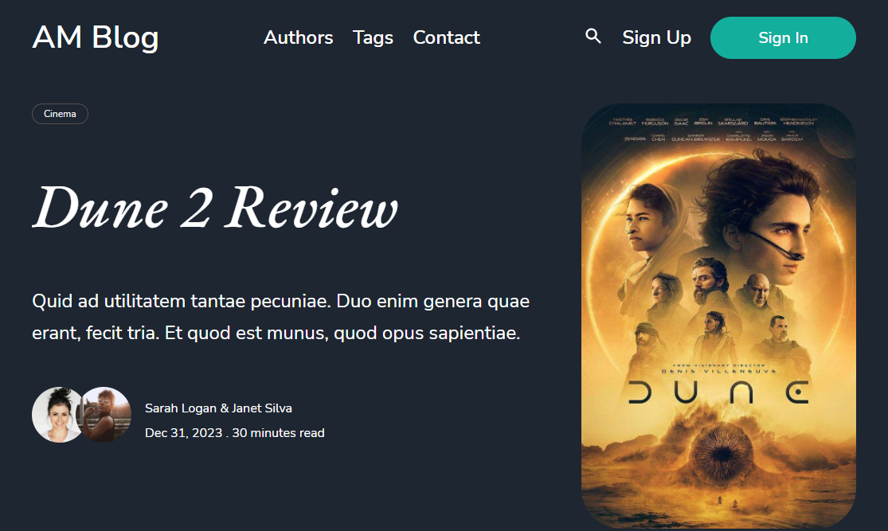
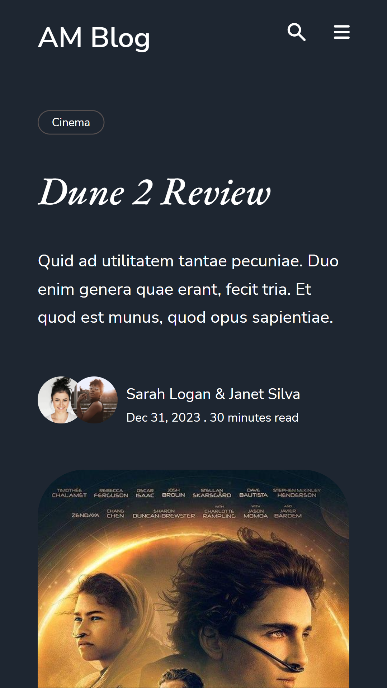

# AM Blog

This is a blog made using ReactJS and fake JSON data backend

## Table of contents

- [Overview](#overview)
  - [The challenge](#the-challenge)
  - [Screenshot](#screenshot)
  - [Links](#links)
- [My process](#my-process)
  - [Built with](#built-with)
  - [What I learned](#what-i-learned)
  - [Continued development](#continued-development)
  - [Useful resources](#useful-resources)
- [Authors](#authors)
- [Acknowledgments](#acknowledgments)

## Overview

### Features

Users can:

- View the optimal layout for the blog depending on their device's screen size
- View blog post, authors and tags pages
- Add comment to blogpost
- Search for blog posts, authors or tags

### Screenshot

                This is a desktop View.
                 

                 This is for mobile view taken on a Pixel 2.
                 
  

   
  

  
### Links

- [Live Site URL](https://am-blogg.netlify.app/)

##  Process

### Built with

- Semantic HTML5 markup
- Flexbox
- CSS Grid
- [React](https://reactjs.org/) - JS library
- [Styled Components](https://styled-components.com/) - For styles
- React Instant search by Algolia
- Disqus - For comments

### Continued development

 - Create a Restful API and adding Authentication and authorization using Backend Framework.
 - Implementing remaining pages

### Useful resources

- StackOverflow (Some helpful guides and tips)

## Authors

- Twitter - https://twitter.com/albert_sigsbert
- Twitter - https://twitter.com/_micahcodes
